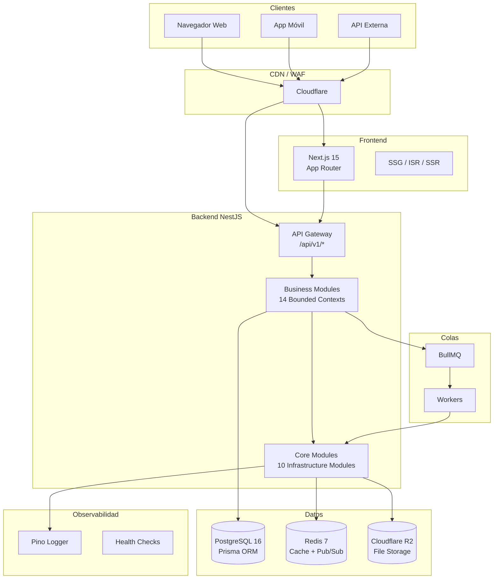
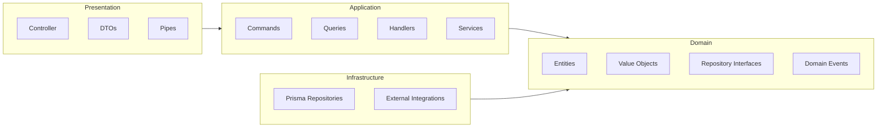
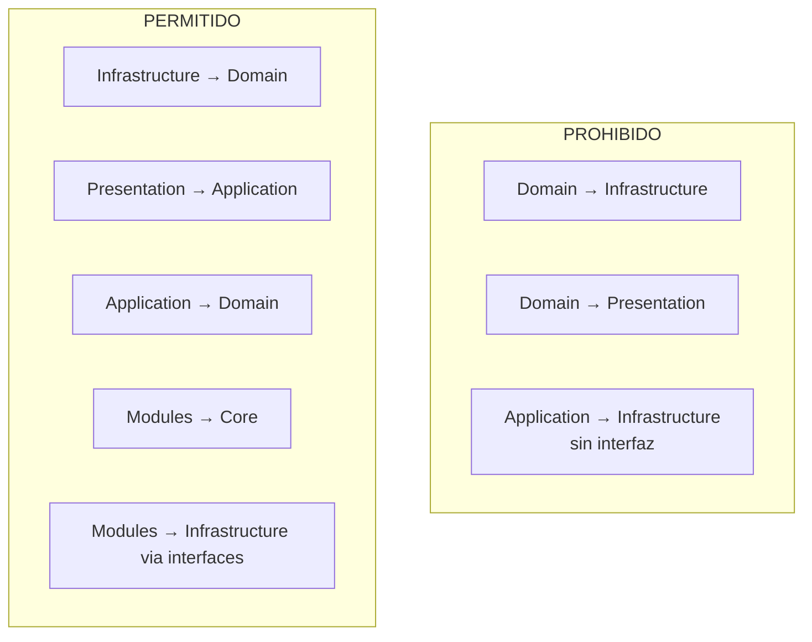

# Arquitectura Tienda

## Principios Arquitectónicos

1. **Clean Architecture** — Dependencias unidireccionales hacia el dominio
2. **Domain-Driven Design** — Bounded Contexts, Aggregate Roots, Value Objects
3. **Vertical Slice Architecture** — Módulos auto-contenidos por funcionalidad
4. **CQRS Ready** — Separación de commands y queries
5. **SOLID** — Cada clase una responsabilidad
6. **Repository Pattern** — Domain define interfaces, Infrastructure implementa
7. **Dependency Injection** — NestJS DI nativo
8. **API First** — OpenAPI 3.1 como contrato
9. **Multi-tenant Day 1** — Shared DB + tenant_id + RLS

## Diagrama de Alto Nivel

## Capas Clean Architecture por Módulo

## Bounded Contexts

| Contexto | Tipo | AR Principal | Dependencias |
|----------|------|-------------|--------------|
| Identity | Supporting | User, Tenant, Role | - |
| Catalog | Core | Product | Identity |
| Inventory | Core | Stock | Catalog |
| Sales | Core | Order | Catalog, Inventory, Finances |
| Purchasing | Core | PurchaseOrder | Catalog, Inventory |
| Customers | Supporting | Customer | Identity |
| Suppliers | Supporting | Supplier | - |
| Finance | Core | Transaction | Sales |
| Cash | Core | CashRegister | Finance |
| CRM | Supporting | CustomerSegment | Customers |
| Marketing | Generic | Coupon | Sales, Catalog |
| CMS | Generic | Page | - |
| Audit | Generic | AuditLog | - |
| Notifications | Generic | Notification | - |

## Core Infrastructure Modules

| Módulo | Propósito | Drivers |
|--------|-----------|---------|
| Logger | Logging estructurado | Pino |
| Database | ORM + conexión PostgreSQL | Prisma |
| Cache | Almacenamiento clave-valor | Redis (ioredis) |
| EventBus | Eventos de dominio | NestJS EventEmitter |
| Queue | Colas de procesamiento | BullMQ |
| Storage | Almacenamiento de archivos | Local, Memory, S3 |
| Mail | Envío de emails | SMTP, Log, SES, SendGrid, Mailgun, Resend |
| Http | Cliente HTTP saliente | Undici, Axios, Got |
| Api | Infraestructura REST | Pipes, Interceptors, Swagger |
| Security | Seguridad HTTP | Helmet, CORS, Rate-Limit |

## Reglas de Dependencia

## Comunicación entre Módulos

- **Eventos de dominio** vía EventBus (desacoplado)
- **No imports directos** entre módulos de negocio
- **Core modules** son `@Global()` y accesibles via DI
- **Colas BullMQ** para procesamiento asíncrono cross-module

## Estrategia Multi-tenant

- Shared database con `tenant_id` en todas las tablas
- Row-Level Security (RLS) para aislamiento
- Tenant resuelto via header `x-tenant-slug` o subdominio
- Evolución futura a dedicated databases por tenant premium

## Seguridad

```mermaid
graph LR
    REQ[HTTP Request] --> PROXY[Trusted Proxy]
    PROXY --> COMP[Compression]
    COMP --> RLIM[Request Limits]
    RLIM --> HEAD[Security Headers]
    HEAD --> HELM[Helmet]
    HELM --> CORS[CORS]
    CORS --> RATE[Rate Limiting]
    RATE --> CSRF[CSRF]
    CSRF --> VALID[Validation]
    VALID --> AUTH[Auth Guards]
    AUTH --> APP[Controller]
```

## Testing

| Tipo | Backend | Frontend |
|------|---------|----------|
| Unit | Jest | Vitest |
| Integration | Jest + NestJS Testing | Vitest |
| E2E | Supertest | Playwright (future) |
| Coverage target | 90% | 90% |
| Factories | packages/testing | packages/testing |
| Mocks | packages/testing | packages/testing |

Documentación completa en [docs/](/docs/).
