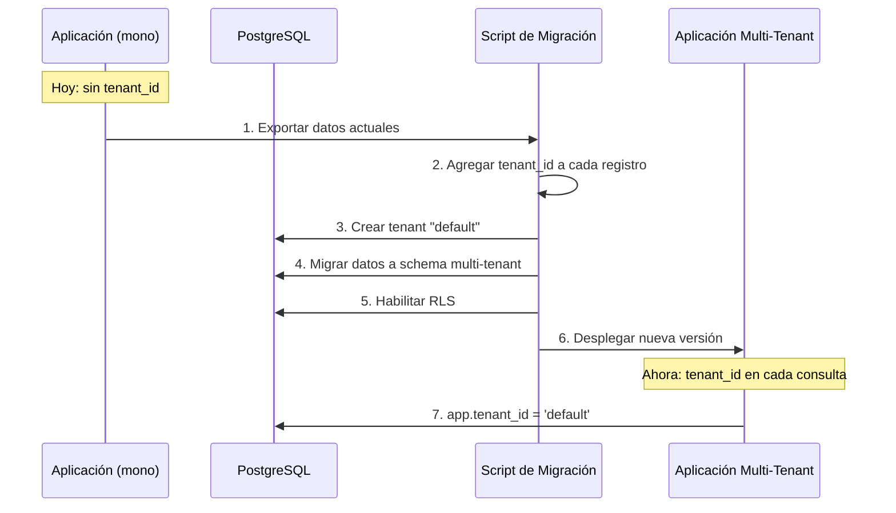

# FASE 1 — Arquitectura del Sistema

> Diseñada para escalar desde una tienda única hasta un SaaS multi-tenant sin reescribir componentes clave.

---

## 1. Diagrama de Arquitectura (vista general)

```
┌─────────────────────────────────────────────────────────────────────┐
│                            CDN (Cloudflare)                         │
└─────────────────────────────────────────────────────────────────────┘
         │                                    │
         ▼                                    ▼
┌─────────────────────┐          ┌──────────────────────────┐
│   Frontend Público   │          │   Admin Dashboard (SPA)   │
│   (Next.js / SSR)    │          │   (Next.js / CSR)         │
│   www.tienda.com     │          │   admin.tienda.com        │
└──────────┬──────────┘          └──────────┬───────────────┘
           │                                 │
           └──────────────┬──────────────────┘
                          │
                          ▼
              ┌─────────────────────┐
              │   API Gateway       │
              │   (Kong / Nginx)    │
              └──────────┬──────────┘
                         │
                         ▼
              ┌─────────────────────┐
              │   BFF / GraphQL      │
              │   (Apollo Server)    │
              └──────────┬──────────┘
                         │
          ┌──────────────┼──────────────┐
          │              │              │
          ▼              ▼              ▼
  ┌────────────┐ ┌────────────┐ ┌────────────┐
  │  Auth Svc  │ │  Catalog   │ │  Orders    │
  │ (Go/Node)  │ │  Svc (Go)  │ │  Svc (Go)  │
  └─────┬──────┘ └─────┬──────┘ └─────┬──────┘
        │              │              │
        └──────┬───────┴──────┬───────┘
               │              │
               ▼              ▼
       ┌────────────┐ ┌────────────┐
       │  PostgreSQL │ │   Redis    │
       │  (Citius)   │ │  (Caché)   │
       └────────────┘ └────────────┘
```

---

## 2. Principios Arquitectónicos

1. **Multi-tenancy desde el día 0** — Cada tenant (tienda) se aísla por `tenant_id` en todas las tablas. No hay migración traumática cuando se pasa de mono-tienda a multi-tienda.
2. **Microservicios domain-driven** — Catalog, Orders, Auth, Payments, CMS como servicios independientes, cada uno con su propio esquema de DB.
3. **API First** — Todo componente expone una API REST o GraphQL. El frontend es solo un cliente.
4. **Stateless** — Los servicios no guardan estado local; la sesión vive en Redis o JWT.
5. **Observabilidad** — Logs estructurados, tracing distribuido (OpenTelemetry), métricas (Prometheus).
6. **Infraestructura como Código** — Terraform + Docker Compose (dev) / Kubernetes (prod).

---

## 3. Stack Tecnológico

| Capa | Tecnología | Justificación |
|-----|-----------|---------------|
| **Frontend** | Next.js 14+ (App Router), TailwindCSS, shadcn/ui, TypeScript | SSR, SEO, DX excelente, ecosistema maduro |
| **BFF / GraphQL** | Apollo Server (Node.js/TypeScript) | Un solo punto de entrada para el frontend, evita over-fetching |
| **Microservicios** | Golang (servicios transaccionales) / Node.js (servicios de contenido) | Go para alta concurrencia (catálogo, órdenes); Node para rapidez de desarrollo (CMS, notificaciones) |
| **Base de Datos** | PostgreSQL 16 + pgvector (futuro: búsqueda semántica) | Relacional, maduro, soporte multi-tenant nativo (RLS) |
| **Caché** | Redis 7 | Caché de sesión, rate limiting, colas ligeras |
| **Colas** | RabbitMQ / BullMQ (Redis) | Procesamiento asíncrono de emails, notificaciones, reportes |
| **Object Storage** | MinIO (self-hosted) / S3 (cloud) | Imágenes de productos, assets de temas |
| **Búsqueda** | Meilisearch | Búsqueda全文 rápida, typo-tolerance, faceted search |
| **API Gateway** | Kong / Nginx | Rate limiting, auth, routing, WAF |
| **Infraestructura** | Docker + Kubernetes (k3s o EKS) | Portabilidad, auto-scaling |
| **CI/CD** | GitHub Actions + ArgoCD | GitOps, deploys automáticos |
| **Monitoreo** | Prometheus + Grafana + Sentry | Métricas, logs, errores |

---

## 4. Modelo Multi-Tenant

### Estrategia: Shared Database por default con Row-Level Security (RLS)

```
Tabla: products
┌────────────┬───────────┬──────────────┬──────────┐
│ tenant_id  │ id        │ name         │ price    │
├────────────┼───────────┼──────────────┼──────────┤
│ t_shop_a   │ 1         │ Remera Azul  │ 15.00    │
│ t_shop_a   │ 2         │ Jean Negro   │ 35.00    │
│ t_shop_b   │ 1         │ Zapatillas   │ 50.00    │
└────────────┴───────────┴──────────────┴──────────┘
```

**Política RLS en PostgreSQL:**

```sql
CREATE POLICY tenant_isolation ON products
  USING (tenant_id = current_setting('app.tenant_id')::TEXT);
```

**Ventajas:**
- Un solo cluster de PostgreSQL para N tenants (costo eficiente).
- Aislamiento lógico sin overhead operativo de N bases de datos.
- Si un tenant crece mucho, se puede migrar a su propia instancia sin impacto.

### Evolución planificada:

| Fase | Modelo | Escenario |
|------|--------|-----------|
| MVP | Sin tenant_id (mono-tienda) | Validación inicial |
| Fase 1 | Shared DB + tenant_id + RLS | Multi-tienda pequeña/mediana |
| Fase 2 | Shared DB + pool dedicado o DB por tenant | Tenants grandes con requisitos de aislamiento |

---

## 5. Frontend — Estrategia de Rutas

```
/                         → Landing pública de la tienda
/[slug]                   → Página de producto (SSG/ISR)
/cart                     → Carrito de compras (CSR)
/checkout                 → Checkout (CSR)
/account/*                → Panel de cliente (CSR)
/admin/*                  → Dashboard admin (CSR)

Arquitectura por tenant:
  next.config.js detecta subdominio o ruta
  → www.mitienda.com         (subdominio = tenant)
  → midominio.com/tienda     (ruta = tenant, futuro)
```

---

## 6. API Design

### GraphQL (BFF) — para frontend

```graphql
type Product {
  id: ID!
  name: String!
  price: Float!
  variants: [Variant!]!
  images: [Image!]!
  category: Category
  seo: SEOInfo
}

type Query {
  product(slug: String!): Product
  products(filters: ProductFilters, page: Int, limit: Int): ProductConnection!
  cart(token: String!): Cart
  order(id: ID!): Order
}
```

### REST — para integraciones externas y admin

```
GET    /api/v1/products?tenant=:id&page=1&limit=20
POST   /api/v1/products
PUT    /api/v1/products/:id
DELETE /api/v1/products/:id

GET    /api/v1/orders?status=pending
POST   /api/v1/orders/:id/status
```

---

## 7. Seguridad

| Capa | Medida |
|------|--------|
| **Transporte** | TLS 1.3, HSTS, HTTP/2 |
| **API** | Rate limiting (100 req/min por IP), JWT con refresh tokens, CORS restringido |
| **DB** | Vault para secrets, conexiones cifradas, RLS multi-tenant, backups cifrados |
| **Frontend** | CSP headers, XSS sanitization, CSRF tokens |
| **Auth** | bcrypt + salt, OAuth 2.0, MFA opcional |
| **Infra** | WAF (Cloudflare), escaneo de vulnerabilidades semanal, dependencias auditadas (Dependabot) |

---

## 8. Data Flow — Compra Exitosa

```
1. Cliente navega catálogo                 → Next.js renderiza desde Meilisearch o SSR
2. Agrega producto al carrito              → POST /api/cart → Redis (carrito temporal)
3. Inicia checkout                         → GET /checkout → BFF consulta carrito + shipping
4. Completa formulario de envío            → PUT /checkout/address → BFF
5. Selecciona pago (Mercado Pago)          → POST /checkout/payment → Payment Svc → API MP
6. MP confirma pago                        → Webhook → Payment Svc → Orders Svc (crear orden)
7. Orders Svc persiste en PostgreSQL       → INSERT INTO orders (tenant_id, ...)
8. Se encola notificación                  → BullMQ → Email Svc (SendGrid) + WhatsApp Svc
9. Frontend recibe confirmación            → WebSocket / polling → order confirmation page
10. Admin ve pedido en dashboard           → GraphQL subscription
```

---

## 9. Despliegue y DevOps

### Entornos

| Entorno | Propósito | Infra |
|---------|-----------|-------|
| `dev` | Desarrollo local | Docker Compose (1 réplica cada servicio) |
| `staging` | QA + integración | k3s single-node, DB real |
| `prod` | Producción | Kubernetes multi-node (EKS / DOKS) |

### Pipeline CI/CD

```
Git Push → GitHub Actions:
  1. Lint + Type Check
  2. Unit Tests + Integration Tests
  3. Build Docker images
  4. Push a Container Registry (GHCR)
  5. ArgoCD detecta nuevo tag → sync a Kubernetes
     → Rolling update (zero-downtime)
```

### Monitoreo

```yaml
- Métricas: Prometheus (CPU, memoria, latencia P50/P95/P99, throughput)
- Dashboards: Grafana (paneles por servicio y por tenant)
- Logs: Loki o Grafana Cloud (log level, tenant_id indexado)
- Trazas: OpenTelemetry → Jaeger (distributed tracing)
- Alertas: PagerDuty / Slack (p99 > 1s, 5xx > 1%, disco < 20%)
```

---

## 10. Estrategia de Base de Datos

### Esquema principal (PostgreSQL)

```
tenants
  id, name, slug, plan, settings (JSONB), created_at

users
  id, tenant_id, email, password_hash, role, created_at

products
  id, tenant_id, name, slug, description, price, compare_price,
  sku, stock, status, category_id, metadata (JSONB), created_at

product_variants
  id, product_id, name, price_override, stock, sku

categories
  id, tenant_id, name, slug, parent_id

orders
  id, tenant_id, user_id, status, total, shipping_cost,
  payment_id, metadata (JSONB), created_at

order_items
  id, order_id, product_id, variant_id, quantity, unit_price

payments
  id, order_id, provider, status, external_id, amount, created_at

carts (Redis)
  key: cart:{tenant_id}:{token}
  value: { items: [...], coupon: "...", updated_at: ... }
```

### Indexación

```sql
-- Performance crítico:
CREATE INDEX idx_products_tenant ON products (tenant_id, status, created_at DESC);
CREATE INDEX idx_orders_tenant ON orders (tenant_id, created_at DESC);
CREATE INDEX idx_products_search ON products USING GIN (to_tsvector('spanish', name || ' ' || description));
CREATE INDEX idx_orders_user ON orders (tenant_id, user_id, created_at DESC);
```

---

## 11. Costos Estimados (Infraestructura Mensual)

| Recurso | DevOps / Self-hosted | Cloud (AWS/GCP) |
|---------|---------------------|-----------------|
| 2 x VPS (4 vCPU, 8GB RAM) | ~$20 USD | — |
| PostgreSQL (8GB RAM, 100GB SSD) | Incluido en VPS | ~$50 USD (RDS) |
| Redis (2GB) | Incluido en VPS | ~$15 USD (ElastiCache) |
| Object Storage (100GB) | ~$5 USD (MinIO) | ~$5 USD (S3) |
| CDN | Gratis (Cloudflare) | Gratis (Cloudflare) |
| Monitoreo | ~$0 (Grafana OSS) | ~$30 USD (Grafana Cloud) |
| **Total estimado** | **~$25–35 USD/mes** | **~$100–130 USD/mes** |

> Para un SaaS con 50 tiendas, el costo por tenant baja a ~$0.50–$2.60 USD/mes en modalidad self-hosted, o ~$2–$3.50 USD/mes en cloud.

---

## 12. Plan de Migración a Multi-Tenant (Fase 2)



La migración se ejecuta en una ventana de mantenimiento de < 30 minutos y es totalmente reversible.

---

## 13. Checklist de Preparación SaaS

- [x] `tenant_id` en todas las tablas (o planificado)
- [x] Aislamiento de datos por tenant (RLS)
- [x] Panel de administración de tenants
- [x] Modelo de suscripción (Stripe recurrente) en el código
- [x] Onboarding automatizado (crear tenant → DNS → certificado SSL)
- [x] Facturación por uso (opcional)
- [x] Métricas por tenant
- [x] Logs indexados por tenant
- [x] Rate limiting diferenciado por plan
- [x] Temas/plugins aislados por tenant
